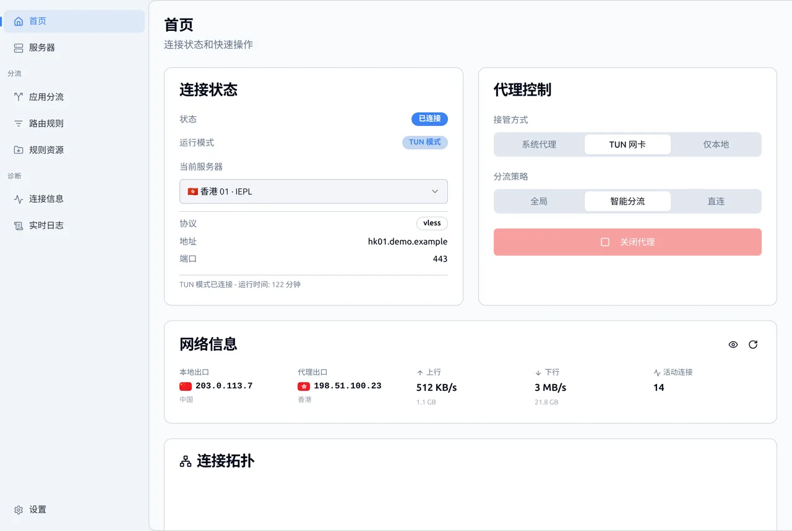
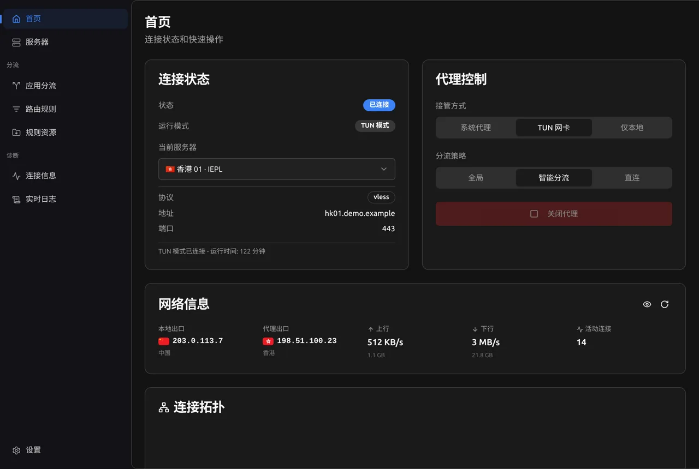
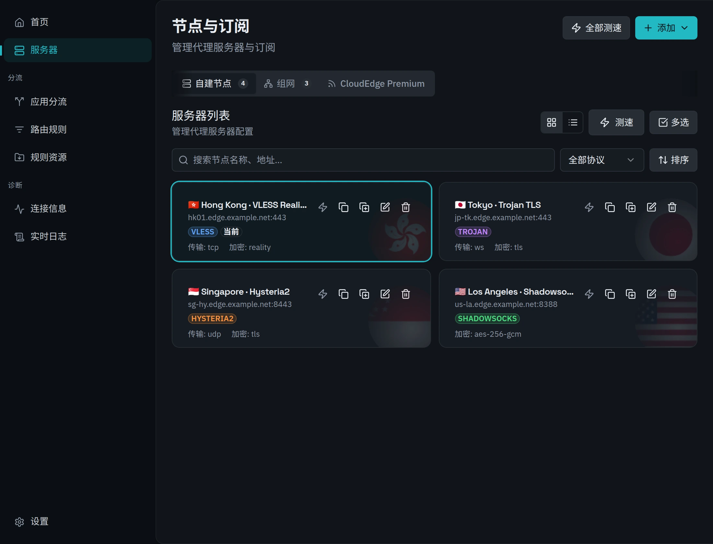
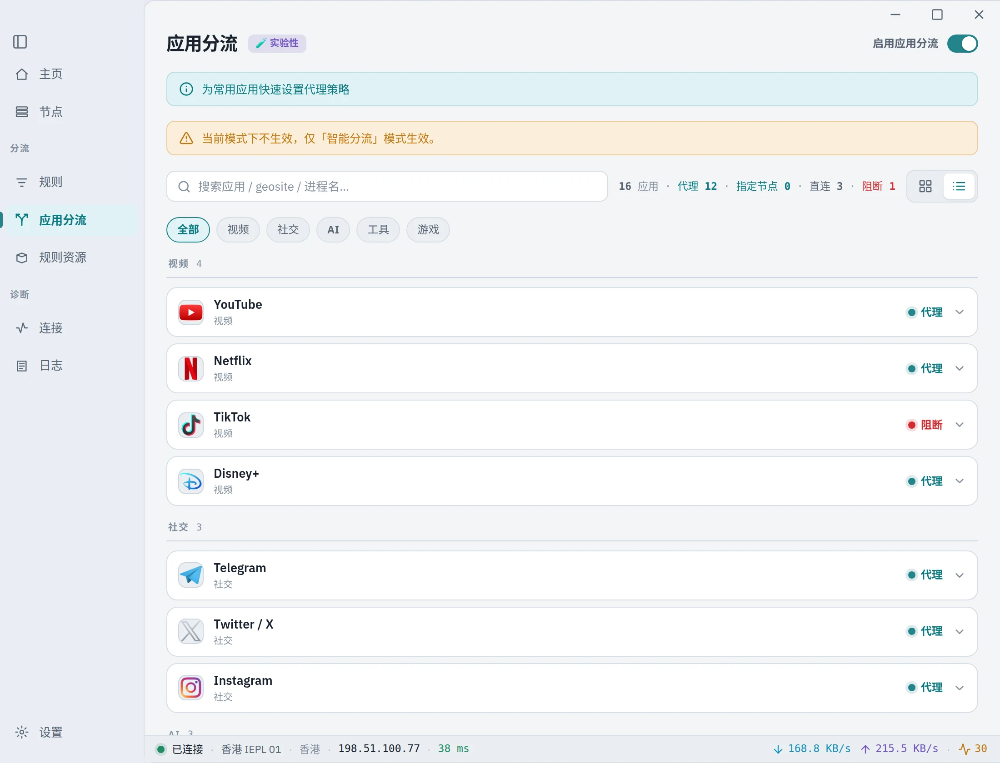
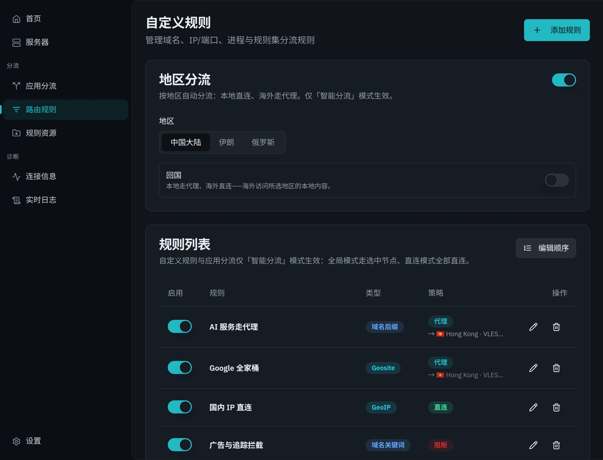
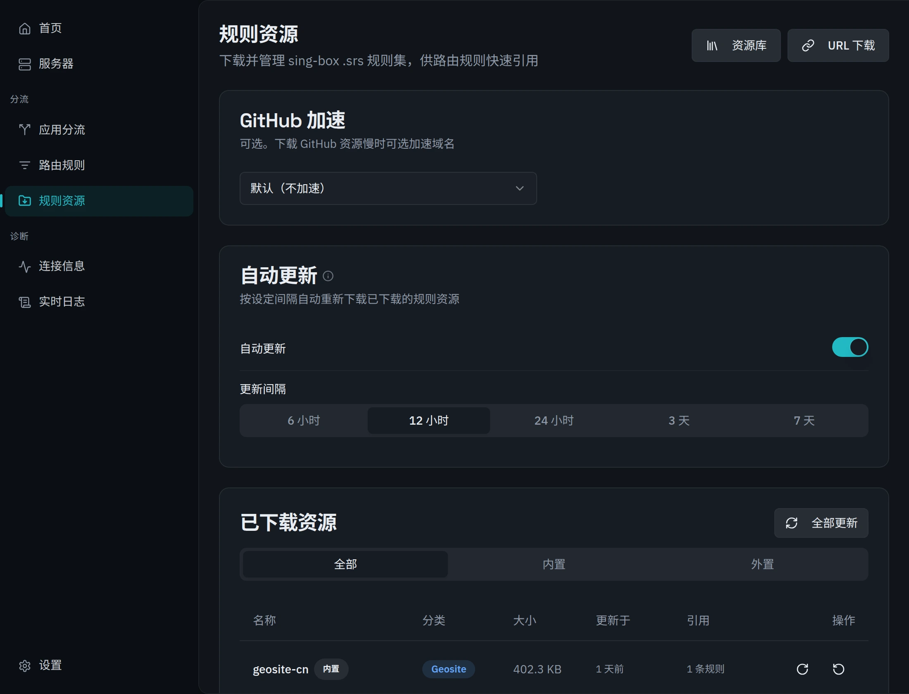
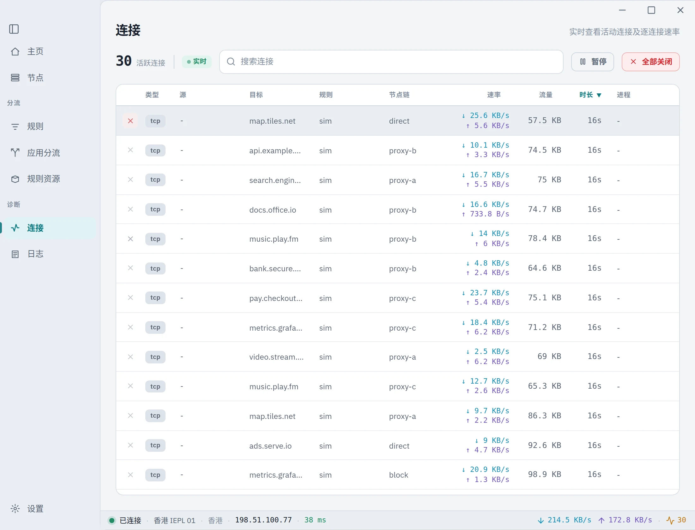
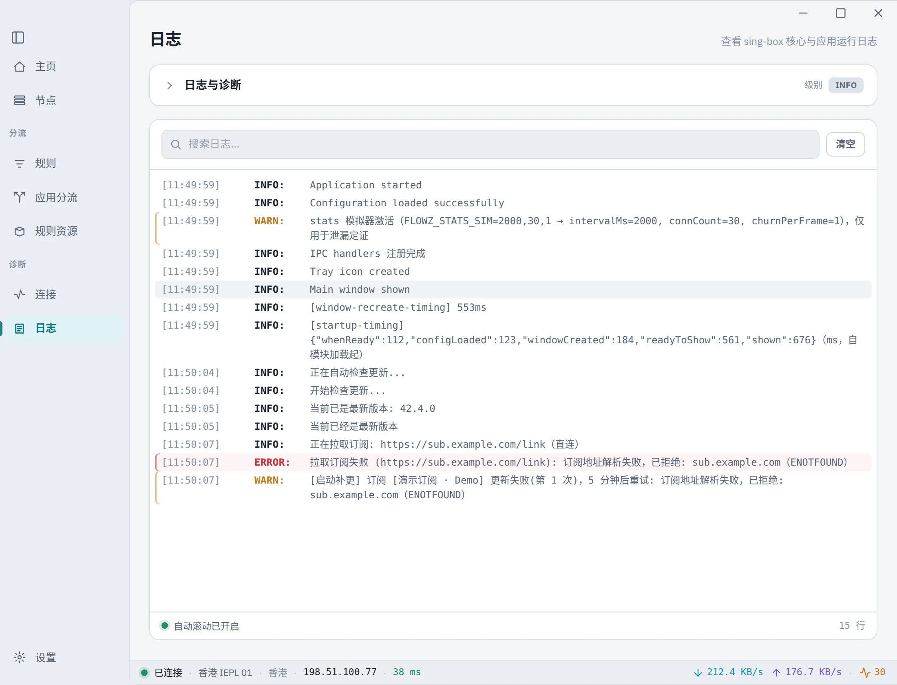
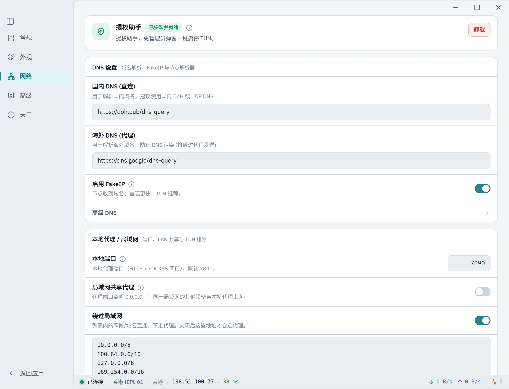

# FlowZ

> 原作者开源地址：https://github.com/zhangjh/FlowZ

简洁现代的**跨平台代理客户端**，基于 [sing-box](https://github.com/SagerNet/sing-box) 1.13.13 核心。
支持 VLESS / VMess / Trojan / Shadowsocks / Hysteria2 / TUIC / AnyTLS / NaiveProxy / Shadow-TLS / SOCKS / HTTP / SSH。

主打：**配置简单 · 规则明确 · 所见即所得 · 稳定好用**。

---

## ✨ 功能特性

**协议与核心**
- ✅ 多协议：VLESS / VMess / Trojan / Shadowsocks / Hysteria2 / TUIC / AnyTLS / **NaiveProxy** / Shadow-TLS / SOCKS / HTTP / SSH
- ✅ sing-box 1.13.13 统一核心（Windows / macOS arm64+x64 / Linux）
- ✅ 抗封增强：**TLS Fragment**（全局）/ **ECH** / **Multiplex** / **httpupgrade** / **Hysteria2 端口跳跃**（订阅自动识别，部分提供手动开关）
- ✅ **Block QUIC**（节点无关）：reject 代理向 QUIC/UDP 443、逼浏览器回退 TCP，解决节点 UDP relay 不通导致的网页卡顿

**代理模式与接管**
- ✅ **TUN 透明代理**（System / gVisor / Mixed 栈）+ **系统代理模式** + 仅本地代理模式
- ✅ 代理模式：全局 / 智能（自动分流，推荐）/ 直连
- ✅ **无缝热切换节点**（selector + clash_api，默认优雅不断流；可选「切换时中断现有连接」）
- ✅ 代理链（前置代理）

**路由规则**
- ✅ 强大的路由规则系统：**单条规则多条件组合**（域名 / IP / 端口 / 进程 / geosite / geoip / 规则集 共 13 种类型，OR/AND 组合）
- ✅ **规则资源体系**：内置 geosite/geoip 精选清单 + 远程 `.srs`/`.json` 规则集下载与定期更新
- ✅ 列表搜索 + **拖拽排序**（置顶/置底/上下移/键盘无障碍）
- ✅ 列表显**备注名**（必填，便于辨识），悬浮展开完整规则（类型 / 值 / 策略）
- ✅ **改规则值零重启**：编辑已启用规则的匹配值（如往域名清单加一条）经 local rule_set 热重载即时生效、连接不中断；增/删/排序/改策略等结构变更才重启（并合并去抖，连改多条只重启一次）
- ✅ **应用分流**：按进程名/路径指定代理 / 直连 / 阻止

**订阅**
- ✅ 订阅链接导入（支持 sing-box JSON 与常见分享格式）
- ✅ 自动更新调度（**默认开启**）：启动补更陈旧订阅 + 周期巡检 + 失败指数退避 + 「经代理更新」开关，更新**不打断当前连接**
- ✅ 节点稳定指纹对账：订阅更新保留本地 id / 选中节点，连接零中断

**界面与体验**
- ✅ 现代化 UI（shadcn/ui）+ 亮 / 暗主题 + 中 / 英文切换
- ✅ 连接拓扑展示 · 实时流量统计与测速 · 出口 IP 展示
- ✅ **隐私保护模式**（密码锁，scrypt 哈希存独立文件、不入配置）
- ✅ **自动空闲模式**（系统空闲触发轻量 / 隐私模式，powerMonitor 真实输入空闲判定）
- ✅ **macOS 菜单栏常驻**：关窗即从程序坞隐去、仅留菜单栏，点菜单栏/Spotlight 唤回
- ✅ 开机自启动 + 自动连接 + 静默启动

**系统与可靠性**
- ✅ **零授权提权链（macOS + Windows）**：装一次提权 helper / 服务后，TUN 模式启停 / 切换节点 / 退出 / 崩溃回收**免每次授权**（macOS root daemon · Windows LocalSystem 服务 · 命名管道/socket + token 鉴权）
- ✅ **退出零残留**：跨平台清理 sing-box 进程 / Wintun 适配器 / 系统代理注册表，崩溃 / 注销 / 关机兜底
- ✅ 自动更新：下载完整性校验 + 启动预检 + 失败自动回滚 + 问题版本跳过
- ✅ 跨平台：Windows / macOS（Apple Silicon + Intel）/ Linux

---

## 🖼 界面预览

> 截图为内置 demo 数据，非真实订阅 / 节点。

### 首页 · 连接总览
所见即所得的连接状态、节点切换、实时速率与连接拓扑。浅色 / 深色双主题：

| 浅色主题 | 深色主题 |
|:---:|:---:|
|  |  |

### 节点与订阅
订阅一键导入、节点卡片管理、协议标识、批量测速与排序：



### 应用分流 · 路由规则
按应用一键指定 代理 / 直连 / 阻止；规则支持多条件组合（域名 / IP / 端口 / 进程 / geosite 等 13 类，OR/AND）+ 拖拽排序 + 改值零重启：

| 应用分流 | 路由规则 |
|:---:|:---:|
|  |  |

### 规则资源
内置 geosite/geoip 精选清单 + 远程 `.srs` 规则集下载与定期更新：



### 连接诊断 · 实时日志
逐连接速率 / 规则命中 / 节点链；分级实时日志：

| 连接信息 | 实时日志 |
|:---:|:---:|
|  |  |

### 设置 · 一次授权零提权
精细设置；**装一次提权 helper / 服务后，TUN 模式启停免每次授权**（Windows 一次 UAC / macOS 一次密码）：

| 设置 | Windows 提权服务 | macOS 提权 helper |
|:---:|:---:|:---:|
|  |  |  |

---

## 📋 系统要求

| 平台 | 要求 |
|------|------|
| Windows | Windows 10（1809+）/ Windows 11，x64 |
| macOS | macOS 11 (Big Sur)+，Apple Silicon 或 Intel |
| Linux | x86_64，AppImage / `.deb`（TUN 模式需 `pkexec` 一次性授权 setcap） |

---

## 📥 安装

从 [Releases](https://github.com/dododook/FlowZ/releases) 页面下载最新版本。

**Windows** — 运行 `.exe` 安装包（或便携版 `portable.exe`）。

**macOS（Apple Silicon / Intel）** — 打开 `.dmg` 拖入「应用程序」。两个架构均随发布提供（Intel 版 naive 开箱即用）。若提示「软件已损坏」：

```bash
xattr -cr /Applications/FlowZ.app
```

**Linux** — `AppImage` 直接运行，或安装 `.deb`。

---

## 🛠 从源码构建

```bash
git clone https://github.com/dododook/FlowZ.git
cd FlowZ

npm install
npm run dev            # 开发（Vite + Electron 热重载）
npm run build          # 编译主进程 + 渲染端

npm run package:win    # Windows 安装包 + 便携版
npm run package:mac    # macOS（arm64 + x64，含交叉编译 root helper）
npm run package:linux  # Linux（AppImage + deb）
```

- `package:mac` 会先 `build:helper`（Go 交叉编译 macOS 提权 helper），再打两个架构。
- NaiveProxy 的 cronet 库由 `npm run fetch:cronet` 在打包时拉取（见下「NaiveProxy 说明」）。

---

## 🚀 快速开始

1. **添加节点** — 「服务器」页选协议填信息，或在「订阅」导入订阅链接。
2. **选模式** — 首页选 代理模式（默认 智能 / 自动分流），如不用 TUN 可在设置切「系统代理模式」。
3. **启用代理** — 首页点「启用代理」。
4. **（可选）配规则** — 「路由规则」页加自定义规则 / 引用规则集；「应用分流」按应用指定策略。

---

## 🛡 抗封 / 切换 / NaiveProxy 说明

### 无缝切换节点
默认 **selector + clash_api 热切换**：切节点不重启核心、现有连接保留至自然关闭、新连接走新节点（优雅不断流）。高级设置「**切换时中断现有连接**」（默认关）开启后强制断开重建。**编辑已启用规则的匹配值**经 local rule_set 热重载零重启生效；跨模式 / 端口 / TUN / 规则结构（增删/排序/改策略）等改动才重启以应用（多次改动合并去抖、只重启一次）。

### Block QUIC（高级设置）
对**代理向 QUIC（UDP 443）**执行 reject、逼浏览器回退 TCP，解决「节点 UDP relay 不通导致网页卡顿 / 断流」。**节点无关**；hysteria2 / tuic / naive 等以 QUIC 拨号的节点**自身拨号不受影响**。默认关。

### 抗封增强
- **TLS Fragment**（全局开关）：切分 TLS ClientHello，规避基于 SNI 的 DPI 阻断。对所有 TCP-TLS 节点生效；hysteria2 / tuic / naive 自动排除。
- **ECH / Multiplex / httpupgrade / Hysteria2 端口跳跃**：从 **sing-box JSON 订阅自动识别并生效**（Multiplex 对 reality+vision 节点自动跳过；端口跳跃支持多段范围）。

### ⚠️ NaiveProxy（naive）核心库说明
naive 出站底层走 **Chromium 的 Cronet 网络库**以获得与浏览器一致的指纹，各平台链接方式不同：
- **Linux / Windows**：cronet 走**动态库**（`libcronet.so` / `libcronet.dll`），由 `npm run fetch:cronet` 从 [SagerNet/cronet-go](https://github.com/SagerNet/cronet-go/releases) 拉取并随安装包打入（体积大，不入库、打包时拉取）。
- **macOS（arm64 与 x64）**：cronet 由 sing-box 核心**静态编入**（CGO），naive **开箱即用、无需外部库**。

> 缺少 cronet 的平台 / 架构上，naive 节点会被**自动跳过**（不影响其它协议；若选中的正是 naive 节点会明确提示）。

---

## 🔧 技术栈

- **Electron 42** + **React 19** + TypeScript
- **sing-box** 1.13.13（代理核心）
- Tailwind CSS + shadcn/ui（UI）
- Vite（构建）/ electron-builder（打包）
- Go（macOS 提权 helper）

---

## 📄 开源协议

MIT License

---

## ⚠️ 免责声明

本软件仅供学习与研究使用。请遵守当地法律法规。使用本软件所产生的任何后果由使用者自行承担。

---

## ⭐ Star 趋势

[](https://star-history.com/#dododook/FlowZ&Date)
